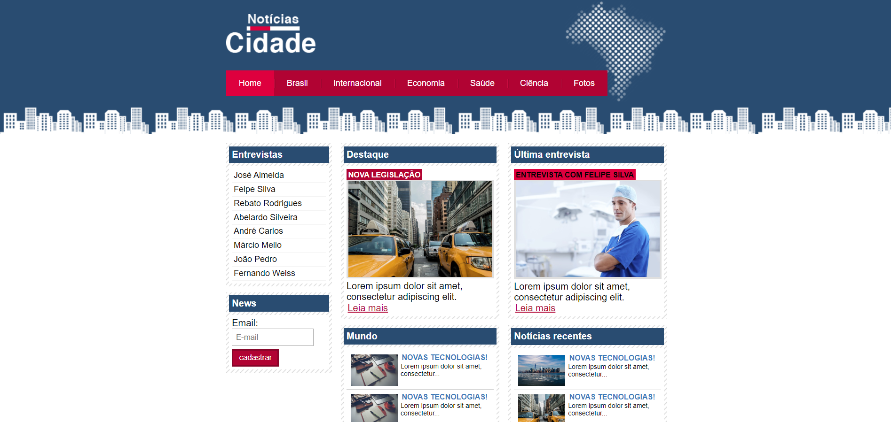
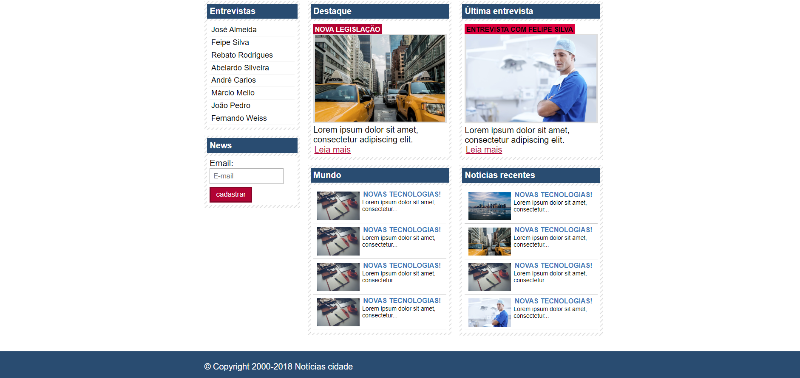
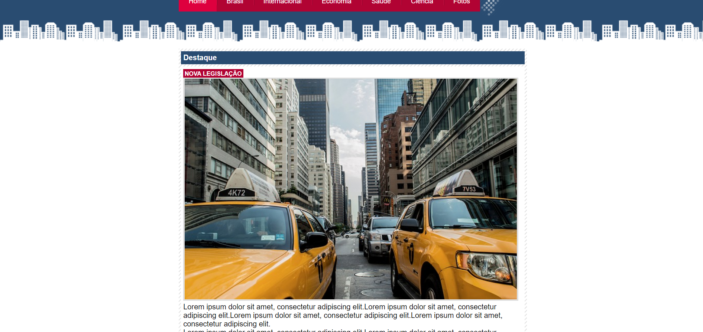
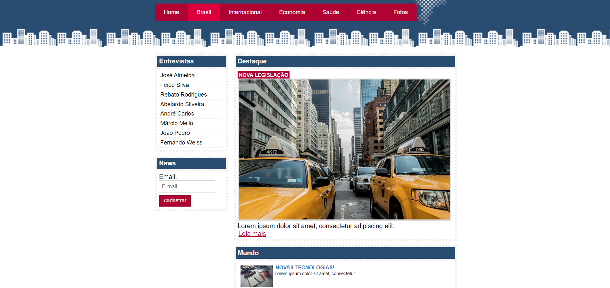

<h1 align="center">Notícias Cidade - seu site de notícias</h1>

Projeto <strong>Notícias Cidade</strong> Desenvolvido durante o curso "Desenvolvimento Web Completo 2020" ministrado por  Jorge Sant Ana e Jamilton Damasceno por meio da plataforma de ensino da <a href ="https://www.udemy.com/">Udemy<a>

## 💻 Front-end

## 🚀 Tecnologias utilizadas:

  [Html](https://www.w3schools.com/html/default.asp)
| [CSS](https://www.w3schools.com/css/)

## 🔧 Projeto

#### Este projeto teve como objetivo criar um Front-end simples utilizando HTML e CSS para um portal de notícias.

## :memo: Licença

#### Esse projeto está sob a licença [MIT](./LICENSE). Veja o arquivo LICENSE para mais detalhes.

Feito com ❤️ Luciano Teles
